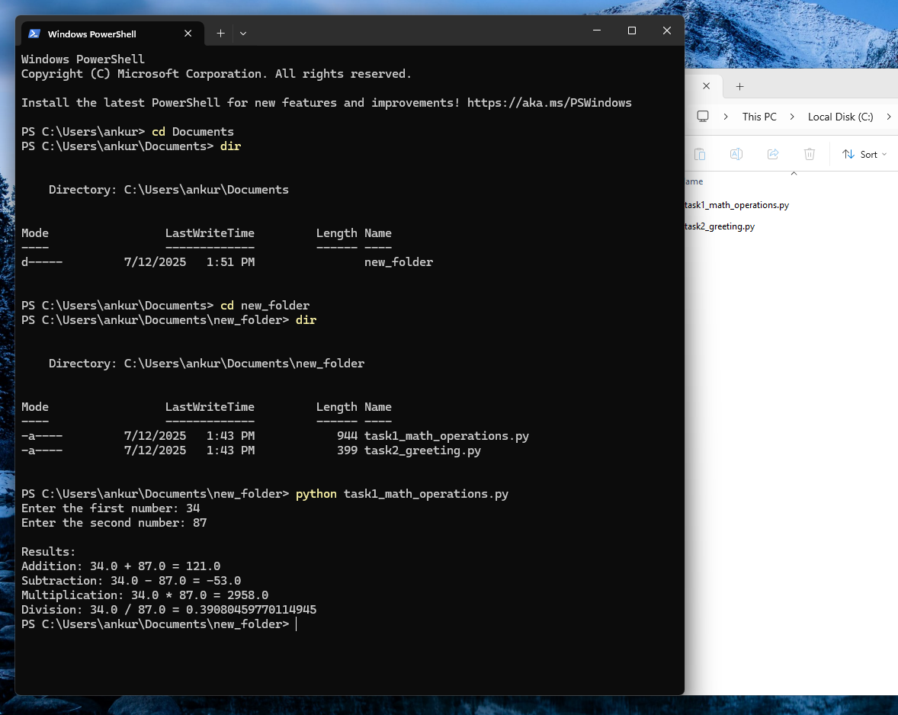
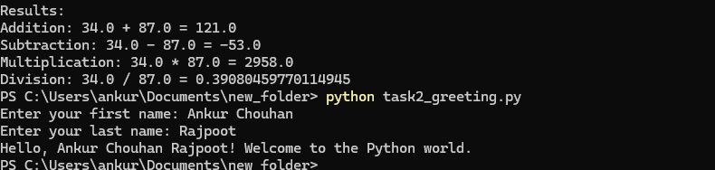

# Python Assignment 1 - Module 2: Basic Python Concepts

This repository contains solutions for Assignment 1 of the Python course (Module 2: Basic Concepts).

## Task 1: Basic Mathematical Operations

- Takes two numbers as input  
- Performs addition, subtraction, multiplication, and division  
- Displays all results with proper formatting and handles division by zero  

## Task 2: Personalized Greeting

- Takes first and last name from the user  
- Concatenates them into a full name  
- Prints a personalized greeting  
